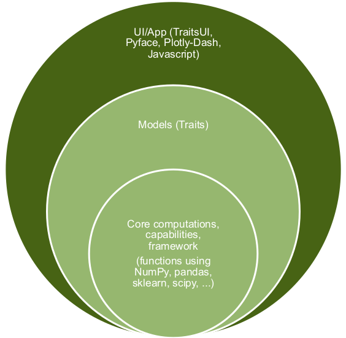
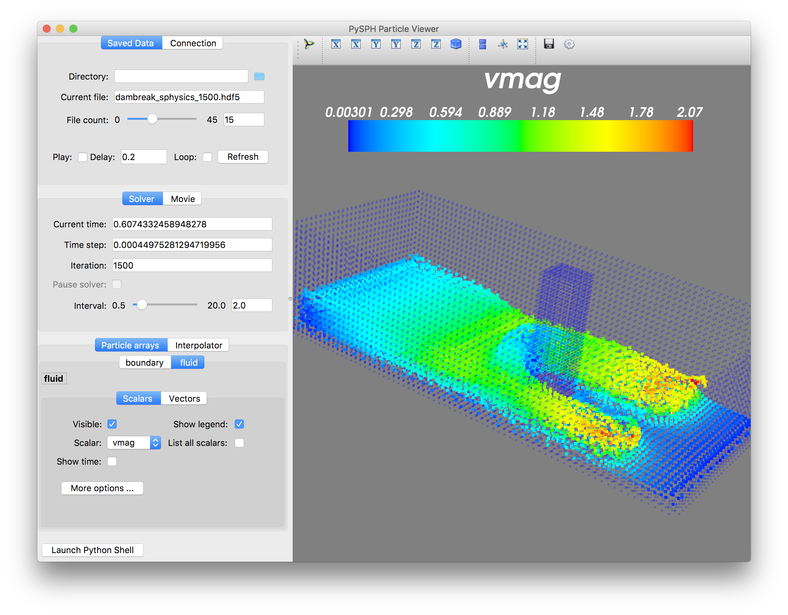

---
jupyter:
  jupytext:
    text_representation:
      extension: .md
      format_name: markdown
      format_version: '1.3'
      jupytext_version: 1.13.7
  kernelspec:
    display_name: Python 3
    language: python
    name: python3
---

<!-- #region slideshow={"slide_type": "slide"} -->
## Sharing scientific tools: script to desktop application

**Jonathan Rocher, Siddhant Wahal, Jason Chambless, Corran Webster, Prabhu Ramachandran**

**SciPy 2022**

<!-- #endregion -->

<!-- #region slideshow={"slide_type": "slide"} -->
## Preliminaries

If you haven't already:
- Clone the repository: https://github.com/jonathanrocher/ets_tutorial
- Install packages:
    - Using Enthought Deployment Manager (recommended)
      (https://www.enthought.com/edm):

       ```bash
       edm envs create bootstrap
       edm install --environment bootstrap click
       edm run -e bootstrap -- python ci build --environment ets_tutorial
       ```
    - `ets_tutorial` will be our working Python environment. To activate:
      ```bash
      edm shell -e ets_tutorial
      ```
    - Follow instructions in README for conda and pip
<!-- #endregion -->


<!-- #region slideshow={"slide_type": "slide"} -->
## Motivation

- Some tasks are easier with a GUI
- Seeing a lot of information in one shot
- Easier for non-programmers
- Easier to share

<!-- #endregion -->

<!-- #region slideshow={"slide_type": "slide"} -->
## Why ETS?

- Mature
- Easy to use
- Design promotes reusable code
- Largely declarative UI
- PyQt/PySide and wxPython support

<!-- #endregion -->

<!-- #region slideshow={"slide_type": "slide"} -->
## What is ETS?

- Enthought Tool Suite: https://docs.enthought.com/ets
- Open Source
- Packages
  - Traits: Python object attributes on steroids
  - TraitsUI: Easy GUI-building
  - PyFace: Low-level GUI components
  - Envisage: plug-in application framework
  - Chaco: interactive plotting library
  - Mayavi: 3D plotting
  - And others

<!-- #endregion -->

<!-- #region slideshow={"slide_type": "slide"} -->
## Layered package design

<center>

</center>

<!-- #endregion -->


<!-- #region slideshow={"slide_type": "slide"} -->
## Sample screenshots

- Can make quite sophisticated UIs
- Much less code
- Easy to write

<!-- #endregion -->

<!-- #region slideshow={"slide_type": "slide"} -->
## A Mayavi-based dialog

<center>

</center>

<!-- #endregion -->

<!-- #region slideshow={"slide_type": "slide"} -->
## A customized viewer

<center>

</center>

<!-- #endregion -->


<!-- #region slideshow={"slide_type": "slide"} -->
## Goals

- Start with simple Python script
  - Detect faces
  - Extract Image metadata

- Build a full-fledged desktop application
  - Easy to use UI
  - Learn a little MVC
  - Design application to scale
- Share the application with others

<!-- #endregion -->

<!-- #region slideshow={"slide_type": "slide"} -->
## Result

Final application we will be building in this tutorial:


<!-- #endregion -->

<!-- #region slideshow={"slide_type": "slide"} -->
## Schedule

- Step 1: Python script
- Step 2: Using Traits.
- Step 3: Basic GUI using TraitsUI
- Step 4: PyFace application: tree navigator
- Step 5: More features
- Step 6: Installer


<!-- #endregion -->

<!-- #region slideshow={"slide_type": "slide"} -->
## Basic Python script

- Uses: `PIL`, `skimage`, and `matplotlib`
- Detects faces in a given image
- Look inside ...

<!-- #endregion -->

<!-- #region slideshow={"slide_type": "slide"} -->
## Next steps

- Learn more about traits
- Build a clean model for our task with traits
- Learn why models are useful

<!-- #endregion -->
